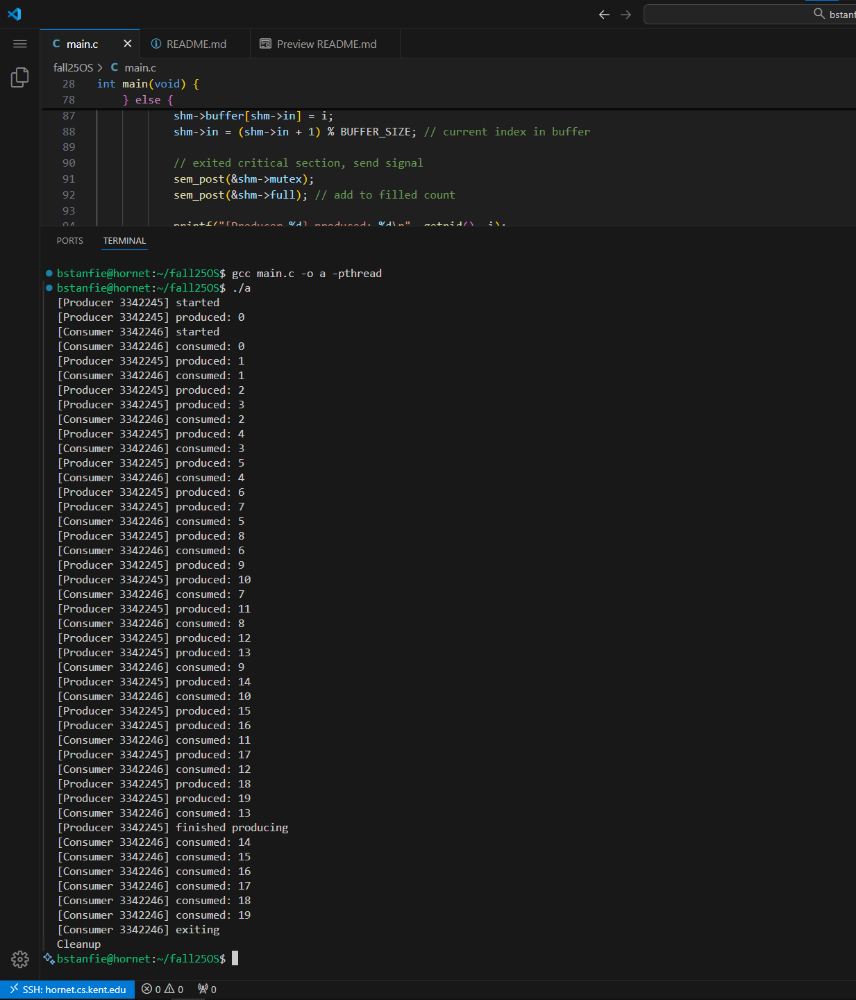

# Program Description

This program demonstrates process-level synchronization between a producer and consumer using POSIX semaphores and shared memory in C on Linux.
It follows the bounded buffer problem model, where the producer inserts items into a shared buffer, and the consumer removes them, while ensuring mutual exclusion.

The parent process is the producer, generating items (integers 0-19) and storing them in a shared buffer of size 10.
The child process is the consumer, removing items and printing them until all have been consumed.

Synchronization and mutual exclusion are handled using semaphores "empty", "full", and "mutex".

# Usage Instructions

use gcc:

```
gcc main.c -o a -pthread
./a
```

we use the -pthread flag because we use POSIX semaphores even though we don't create threads directly.

# Explanation of Key Components

## Shared Memory

The shared memory map (mmap) allows both processes (producer and consumer) to access the same buffer in memory:

shared_data_t *shm = mmap(NULL, BUFFER_SIZE, PROT_READ | PROT_WRITE, MAP_SHARED | MAP_ANONYMOUS, -1, 0);

this structure holds: a buffer of size BUFFER_SIZE, index variables in and out, a done flag, and the 3 semaphores empty, full and mutex.

mutex uses:

empty: tracks available slots for producer
full: tracks filled slots for the consumer
mutex: tracks if something is in critical section

they are initialized using pshared=1 to allow sharing between processes

```c
sem_init(&shm->empty, 1, BUFFER_SIZE);
sem_init(&shm->full, 1, 0);
sem_init(&shm->mutex, 1, 1);
```

when the production is finished we set the done flag to true, and wake the consumer to finish any remaining items.

## Mutual Exclusion

only one process can access the buffer at a time, so we wrap critical sections in sem_wait(&mutex) and sem_post(&mutex):

```c
sem_wait(&shm->mutex);
shm->buffer[shm->in] = i;
shm->in = (shm->in + 1) % BUFFER_SIZE;
sem_post(&shm->mutex);
```

This prevents concurrent read/writes to shared memory.

# Examples & Results

## Example Output

```
bstanfie@hornet:~/fall25OS$ gcc main.c -o a -pthread
bstanfie@hornet:~/fall25OS$ ./a
[Producer 3339880] started
[Producer 3339880] produced: 0
[Consumer 3339881] started
[Consumer 3339881] consumed: 0
[Producer 3339880] produced: 1
[Consumer 3339881] consumed: 1
[Producer 3339880] produced: 2
[Consumer 3339881] consumed: 2
[Producer 3339880] produced: 3
[Producer 3339880] produced: 4
[Consumer 3339881] consumed: 3
[Producer 3339880] produced: 5
...
[Consumer 3339881] consumed: 12
[Producer 3339880] produced: 18
[Producer 3339880] produced: 19
[Consumer 3339881] consumed: 13
[Producer 3339880] finished producing
[Consumer 3339881] consumed: 14
[Consumer 3339881] consumed: 15
[Consumer 3339881] consumed: 16
[Consumer 3339881] consumed: 17
[Consumer 3339881] consumed: 18
[Consumer 3339881] consumed: 19
[Consumer 3339881] exiting
Cleanup
```

## Results

